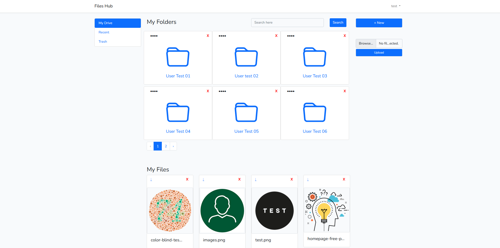
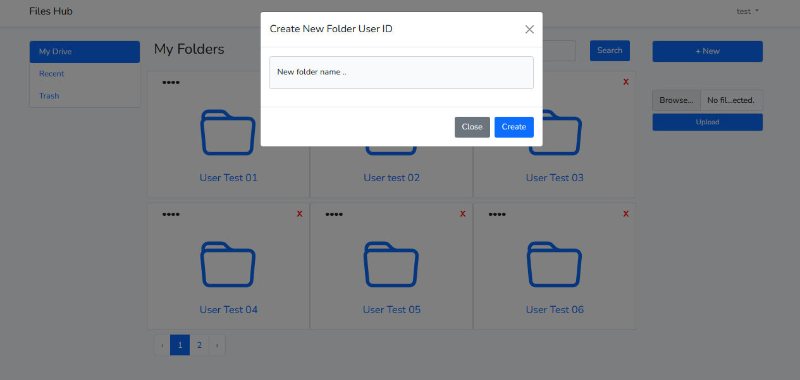
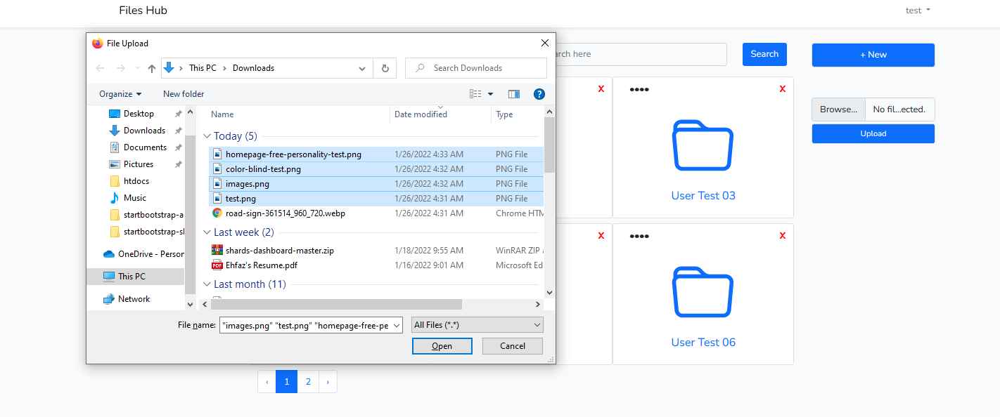
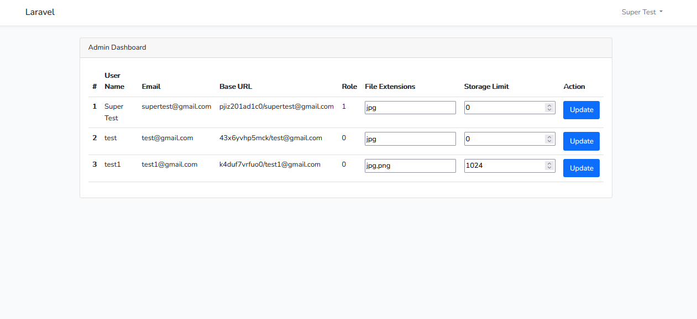

## About Files Hub

Files Hub is a web application creating using popular framework Laravel. Some key features are:

- Endless dynamic folder directory system.
- Single or multiple file upload option.
- File download feature.
- Customizable file extensions.
- Storage size configuration by super admin.
- Very basic and user friendly.

## Technology Used

- Laarvel 8
- MySQL
- Blade Templating

## Installation

- Git Clone
- NPM Install and NPM Run Dev
- PHP artisan migrate
- Php artisan storage:link
- PHP artisan serve

## Some ScreenShots

